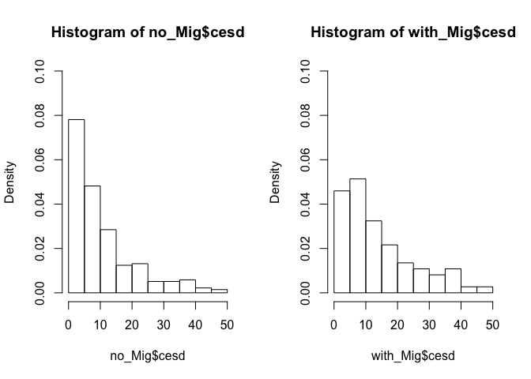
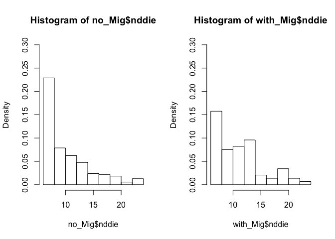
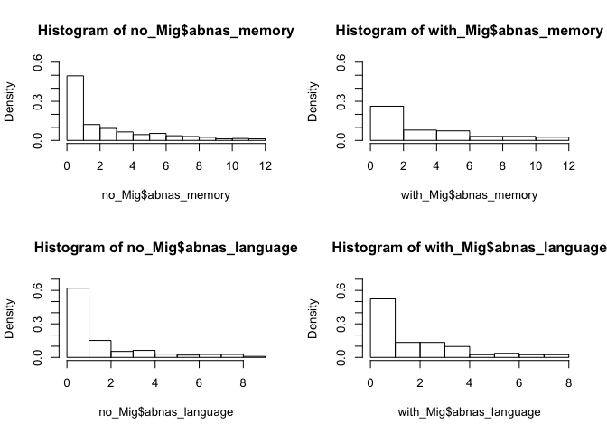
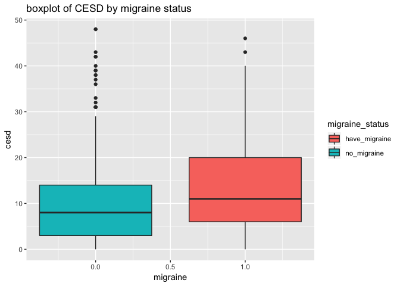
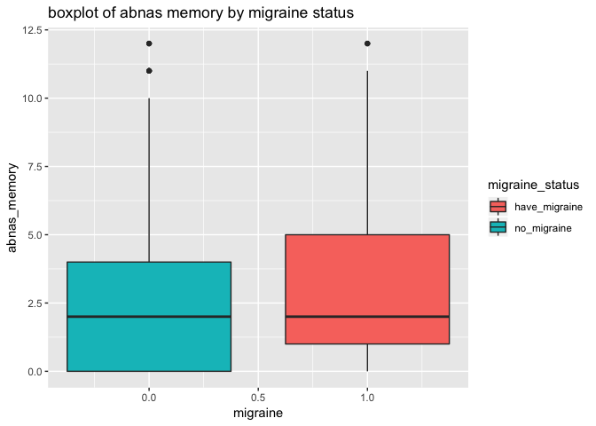
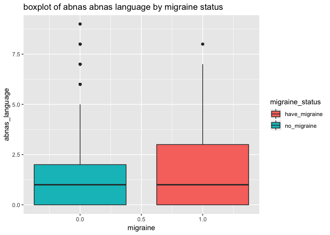

Analysis for HEP Data (Problem 6)
================
Eleanor Zhang
2018-09-27

Overview
========

This document aims to analyze a research study which examining association of depression and cognitive performance with migraine symtoms. HEP Data were collected from patients with new onset of focal epilepsy with their informations including migraine status, score of NDDIE (Neurological Disorders Depression Inventory for Epilepsy), score of CESD (a questionairre screening for depression), cognitive evaluation for both memory and language.

Import Data and Data Cleaning
=============================

``` r
Mig <- read_excel("Migraine.xlsx")
Mig <- janitor::clean_names(Mig) # rename variable names
Mig$migraine_status <- ifelse(Mig$migraine == 1, "have_migraine", "no_migraine")
```

Exploratory Analysis
====================

### Part I: descriptive statistics without cutoffs

Firstly, we can have an general look at the data:

``` r
head(Mig)
```

    ## # A tibble: 6 x 6
    ##   migraine  cesd nddie abnas_memory abnas_language migraine_status
    ##      <dbl> <dbl> <dbl>        <dbl>          <dbl> <chr>          
    ## 1        0    42    NA            1              0 no_migraine    
    ## 2        0    NA     6            0              0 no_migraine    
    ## 3        0    10    11            0              0 no_migraine    
    ## 4        0    NA    NA            1              0 no_migraine    
    ## 5        0    23    16            1              0 no_migraine    
    ## 6        0     6     8            1              0 no_migraine

``` r
str(Mig)
```

    ## Classes 'tbl_df', 'tbl' and 'data.frame':    419 obs. of  6 variables:
    ##  $ migraine       : num  0 0 0 0 0 0 0 0 0 0 ...
    ##  $ cesd           : num  42 NA 10 NA 23 6 NA NA NA NA ...
    ##  $ nddie          : num  NA 6 11 NA 16 8 NA NA NA NA ...
    ##  $ abnas_memory   : num  1 0 0 1 1 1 0 2 0 4 ...
    ##  $ abnas_language : num  0 0 0 0 0 0 0 0 0 0 ...
    ##  $ migraine_status: chr  "no_migraine" "no_migraine" "no_migraine" "no_migraine" ...

``` r
skimr::skim(Mig)
```

    ## Skim summary statistics
    ##  n obs: 419 
    ##  n variables: 6 
    ## 
    ## ── Variable type:character ─────────────────────────────────────────────────────────────────────────────────────
    ##         variable missing complete   n min max empty n_unique
    ##  migraine_status       0      419 419  11  13     0        2
    ## 
    ## ── Variable type:numeric ───────────────────────────────────────────────────────────────────────────────────────
    ##        variable missing complete   n  mean    sd p0 p25 p50  p75 p100
    ##  abnas_language       0      419 419  1.68  2.19  0   0   1  2.5    9
    ##    abnas_memory       0      419 419  2.7   3.12  0   0   2  4     12
    ##            cesd      71      348 419 11.47 10.65  0   3   9 16     48
    ##        migraine       0      419 419  0.2   0.4   0   0   0  0      1
    ##           nddie      73      346 419 10.53  4.48  6   7   9 13     24
    ##      hist
    ##  ▇▂▁▁▁▁▁▁
    ##  ▇▃▁▂▁▁▁▁
    ##  ▇▆▂▂▁▁▁▁
    ##  ▇▁▁▁▁▁▁▂
    ##  ▇▃▂▂▁▁▁▁

Our data is consisted of 419 observations with 5 variables. Some variables contains missing values which need to be taken care of.

Since we are interested in the relationship of cognitive performance, with or without migraine, and depression conditions, we can look at and compare the subset of each variable corresponding to migraine status. So here we subset the whole dataset into two subsets:

``` r
with_Mig <- filter(Mig, migraine == 1)
str(with_Mig)
```

    ## Classes 'tbl_df', 'tbl' and 'data.frame':    82 obs. of  6 variables:
    ##  $ migraine       : num  1 1 1 1 1 1 1 1 1 1 ...
    ##  $ cesd           : num  2 27 7 6 2 16 2 1 NA 2 ...
    ##  $ nddie          : num  8 14 6 13 6 11 6 8 NA 7 ...
    ##  $ abnas_memory   : num  0 2 0 2 0 0 0 1 0 1 ...
    ##  $ abnas_language : num  0 0 0 0 0 0 0 0 0 0 ...
    ##  $ migraine_status: chr  "have_migraine" "have_migraine" "have_migraine" "have_migraine" ...

``` r
no_Mig <- filter(Mig, migraine == 0)
str(no_Mig)
```

    ## Classes 'tbl_df', 'tbl' and 'data.frame':    337 obs. of  6 variables:
    ##  $ migraine       : num  0 0 0 0 0 0 0 0 0 0 ...
    ##  $ cesd           : num  42 NA 10 NA 23 6 NA NA NA NA ...
    ##  $ nddie          : num  NA 6 11 NA 16 8 NA NA NA NA ...
    ##  $ abnas_memory   : num  1 0 0 1 1 1 0 2 0 4 ...
    ##  $ abnas_language : num  0 0 0 0 0 0 0 0 0 0 ...
    ##  $ migraine_status: chr  "no_migraine" "no_migraine" "no_migraine" "no_migraine" ...

Since the `skim` function allows us to the general trend of each variable, we would expect the variables are significantly skewed. To better describe the data, we will use *median* and *interquartile range* to describe each variable in these two sets **with\_Mig** and **no\_Mig**.

``` r
sapply(no_Mig[,2:5], summary)
```

    ## $cesd
    ##    Min. 1st Qu.  Median    Mean 3rd Qu.    Max.    NA's 
    ##    0.00    3.00    8.00   10.68   14.00   48.00      63 
    ## 
    ## $nddie
    ##    Min. 1st Qu.  Median    Mean 3rd Qu.    Max.    NA's 
    ##    6.00    6.00    9.00   10.29   13.00   24.00      64 
    ## 
    ## $abnas_memory
    ##    Min. 1st Qu.  Median    Mean 3rd Qu.    Max. 
    ##   0.000   0.000   2.000   2.555   4.000  12.000 
    ## 
    ## $abnas_language
    ##    Min. 1st Qu.  Median    Mean 3rd Qu.    Max. 
    ##   0.000   0.000   1.000   1.602   2.000   9.000

``` r
sapply(with_Mig[,2:5], summary)
```

    ## $cesd
    ##    Min. 1st Qu.  Median    Mean 3rd Qu.    Max.    NA's 
    ##    0.00    6.00   11.00   14.41   20.00   46.00       8 
    ## 
    ## $nddie
    ##    Min. 1st Qu.  Median    Mean 3rd Qu.    Max.    NA's 
    ##    6.00    8.00   11.00   11.42   14.00   23.00       9 
    ## 
    ## $abnas_memory
    ##    Min. 1st Qu.  Median    Mean 3rd Qu.    Max. 
    ##   0.000   1.000   2.000   3.305   5.000  12.000 
    ## 
    ## $abnas_language
    ##    Min. 1st Qu.  Median    Mean 3rd Qu.    Max. 
    ##   0.000   0.000   1.000   1.976   3.000   8.000

To describe the dataset in terms of sample size (exclude NAs) and missing values:

|                                    |   cesd  |  nddie  | abnas\_memory | abnas\_language |
|------------------------------------|:-------:|:-------:|:-------------:|:---------------:|
| no migraine (sample size\[NAs\])   | 274(63) | 273(64) |     337(0)    |      337(0)     |
| with migraine (sample size\[NAs\]) |  74(8)  |  73(9)  |     82(0)     |      82(0)      |

Put all information about median and IQR together as a table:

|                                     |   cesd   |   nddie  | abnas\_memory | abnas\_language |
|-------------------------------------|:--------:|:--------:|:-------------:|:---------------:|
| no migraine (median\[IQR range\])   |  8(3,14) |  9(6,13) |     2(0,4)    |      1(0,2)     |
| with migraine (median\[IQR range\]) | 11(6,20) | 11(8,14) |     2(1,5)    |      1(0,3)     |

### part II: descriptive statistics with cutoffs

Now we want to further subset some variabls by cutoff values:

-   nddie: &gt;= 16
-   cesd: &gt;= 16

``` r
no_Mig <- na.omit(no_Mig)
with_Mig <- na.omit(with_Mig)
```

``` r
no_Mig$cesd_cutoff <- ifelse(no_Mig$cesd >= 16, "above_16", "below_16")
no_Mig$nddie_cutff <- ifelse(no_Mig$nddie >= 16, "above_16", "below_16")
with_Mig$cesd_cutoff <- ifelse(with_Mig$cesd >= 16, "above_16", "below_16")
with_Mig$nddie_cutoff <- ifelse(with_Mig$nddie >= 16, "above_16", "below_16")
```

then we can summarize those four variables again with median and IQR:

``` r
sapply(no_Mig[which(no_Mig$cesd >= 16), 2:5], summary)
```

    ##          cesd    nddie abnas_memory abnas_language
    ## Min.    16.00  7.00000     0.000000       0.000000
    ## 1st Qu. 18.75 13.00000     2.000000       0.000000
    ## Median  24.00 16.00000     5.000000       1.500000
    ## Mean    26.40 15.43333     5.116667       2.983333
    ## 3rd Qu. 31.00 18.00000     7.250000       6.000000
    ## Max.    48.00 24.00000    12.000000       9.000000

``` r
sapply(no_Mig[which(no_Mig$cesd < 16), 2:5], summary)
```

    ##              cesd     nddie abnas_memory abnas_language
    ## Min.     0.000000  6.000000     0.000000       0.000000
    ## 1st Qu.  2.000000  6.000000     0.000000       0.000000
    ## Median   5.000000  8.000000     1.000000       0.000000
    ## Mean     6.033019  8.849057     1.938679       1.320755
    ## 3rd Qu. 10.000000 11.000000     3.000000       2.000000
    ## Max.    15.000000 24.000000    11.000000       8.000000

``` r
sapply(with_Mig[which(with_Mig$nddie >= 16), 2:5], summary)
```

    ##             cesd    nddie abnas_memory abnas_language
    ## Min.    15.00000 16.00000          0.0       0.000000
    ## 1st Qu. 30.50000 18.50000          2.0       1.000000
    ## Median  36.00000 19.00000          5.0       3.000000
    ## Mean    34.45455 19.45455          5.0       3.272727
    ## 3rd Qu. 40.00000 20.50000          6.5       4.500000
    ## Max.    46.00000 23.00000         12.0       8.000000

``` r
sapply(with_Mig[which(with_Mig$nddie < 16), 2:5], summary)
```

    ##             cesd nddie abnas_memory abnas_language
    ## Min.     0.00000  6.00     0.000000       0.000000
    ## 1st Qu.  5.00000  7.00     0.250000       0.000000
    ## Median   9.50000 10.00     2.000000       1.000000
    ## Mean    10.74194 10.00     2.983871       1.645161
    ## 3rd Qu. 15.00000 12.75     4.750000       3.000000
    ## Max.    34.00000 15.00    12.000000       7.000000

Then the sample size for each conditions:

|                             | cesd &gt;= 16 | cesd &lt; 16 | nddie &gt;= 16 | nddie &lt; 16 |
|-----------------------------|:-------------:|:------------:|:--------------:|:-------------:|
| no migraine (sample size)   |       62      |      212     |       39       |      234      |
| with migraine (sample size) |       26      |      48      |       11       |       62      |

The statistics summary for these cutoffs categories are below:

|                             | cesd &gt;= 16 | cesd &lt; 16 | nddie &gt;= 16 | nddie &lt; 16 |
|-----------------------------|:-------------:|:------------:|:--------------:|:-------------:|
| no migraine (median(IQR))   |  24(19.25,31) |    5(2,10)   |    16(13,18)   |    8(6,11)    |
| with migraine (median(IQR)) |  36(30.5,40)  |   9.5(5,15)  |  19(18.5,20.5) |   10(7,12.5)  |

Look at proportions of each variables in terms of with migraine or without migrain

### Part III : Plotting

1.  Histograms

migraine vs. cesd

``` r
par(mfrow = c(1, 2))
hist(no_Mig$cesd, freq = F, ylim = c(0, 0.1))
hist(with_Mig$cesd, freq = F, ylim = c(0, 0.1))
```



migraine vs. nddie

``` r
par(mfrow = c(1, 2))
hist(no_Mig$nddie, freq = F, ylim = c(0, 0.3))
hist(with_Mig$nddie, freq = F, ylim = c(0, 0.3))
```



migraine vs. abnas memory and language

``` r
par(mfrow = c(2, 2))
hist(no_Mig$abnas_memory, freq = F, ylim = c(0, 0.6))
hist(with_Mig$abnas_memory, freq = F, ylim = c(0, 0.6))
hist(no_Mig$abnas_language, freq = F, ylim = c(0, 0.7))
hist(with_Mig$abnas_language, freq = F, ylim = c(0, 0.7))
```



1.  Boxplots

``` r
ggplot(Mig, aes(x = migraine, y = cesd, fill = migraine_status) ) +
  geom_boxplot() +
  ggtitle("boxplot of CESD by migraine status")
```

    ## Warning: Removed 71 rows containing non-finite values (stat_boxplot).



``` r
ggplot(Mig, aes(x = migraine, y = nddie, fill = migraine_status)) + 
  geom_boxplot() +
  ggtitle("boxplot of nddie by migraine status")
```

    ## Warning: Removed 73 rows containing non-finite values (stat_boxplot).


``` r
ggplot(Mig, aes(x = migraine, y = abnas_memory, fill = migraine_status)) + 
  geom_boxplot() +
  ggtitle("boxplot of abnas memory by migraine status")
```



``` r
ggplot(Mig, aes(x = migraine, y = abnas_language, fill = migraine_status)) + 
  geom_boxplot() +
  ggtitle("boxplot of abnas abnas language by migraine status")
```



Comment
=======

Based on the histograms, we can see that CESD score, NDDIE score, memory and performance
