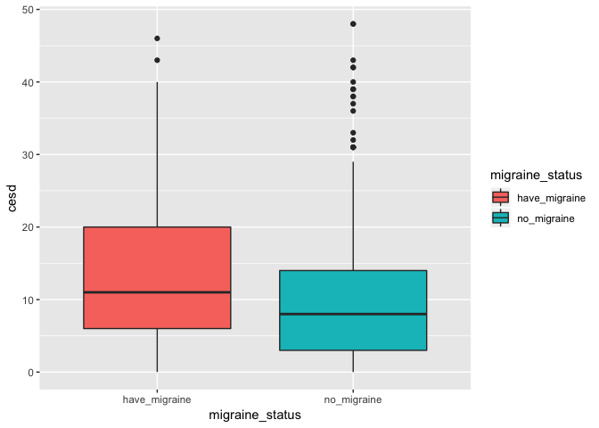
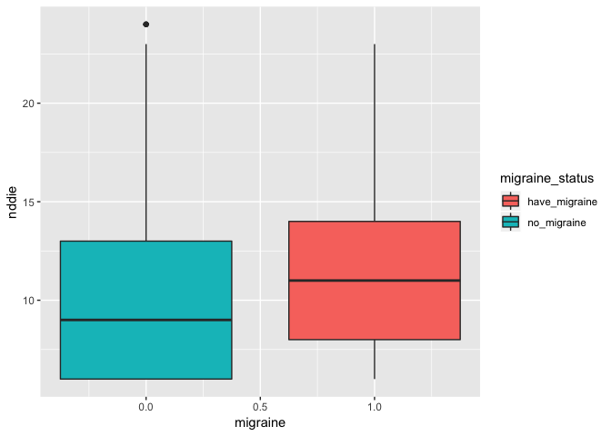
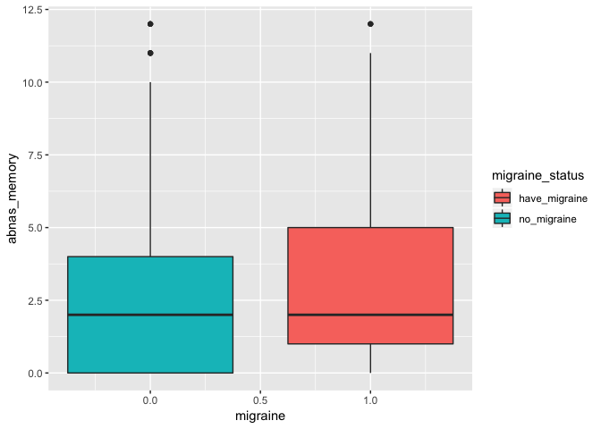
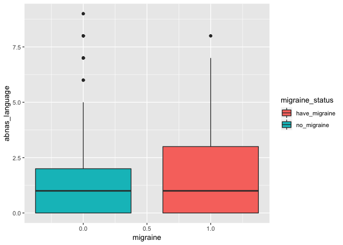

HW2\_code
================

Problem 6
=========

A study is to examine the associations of depression and cognitive performance with migraine symptoms:

Some backgrounds:
-----------------

CESD: questionairre screening for depression; meausre symptoms of depression; sum of scores to all questions; longer duration of symptoms will have greater score.

nddie: The Neurological Disorders Depression Inventory for Epilepsy (NDDI-E) is a 6-item questionnaire validated to screen for depression in people with epilepsy

Import data
-----------

``` r
library(readxl)

excel_sheets("Migraine.xlsx")
```

    ## [1] "Sheet1"

``` r
Mig <- read_excel("Migraine.xlsx")

Mig <- janitor::clean_names(Mig) # rename variable names
```

Have a look at the data:

``` r
head(Mig)
```

    ## # A tibble: 6 x 5
    ##   migraine  cesd nddie abnas_memory abnas_language
    ##      <dbl> <dbl> <dbl>        <dbl>          <dbl>
    ## 1        0    42    NA            1              0
    ## 2        0    NA     6            0              0
    ## 3        0    10    11            0              0
    ## 4        0    NA    NA            1              0
    ## 5        0    23    16            1              0
    ## 6        0     6     8            1              0

``` r
str(Mig)
```

    ## Classes 'tbl_df', 'tbl' and 'data.frame':    419 obs. of  5 variables:
    ##  $ migraine      : num  0 0 0 0 0 0 0 0 0 0 ...
    ##  $ cesd          : num  42 NA 10 NA 23 6 NA NA NA NA ...
    ##  $ nddie         : num  NA 6 11 NA 16 8 NA NA NA NA ...
    ##  $ abnas_memory  : num  1 0 0 1 1 1 0 2 0 4 ...
    ##  $ abnas_language: num  0 0 0 0 0 0 0 0 0 0 ...

``` r
dim(Mig) # 419 observations, 5 variables
```

    ## [1] 419   5

variables in the data:

| Variable names | description                                          |
|:--------------:|:-----------------------------------------------------|
|    Migraine    | Migraine status: 0(no), 1(yes)                       |
|      CESD      | Depression Scale                                     |
|      NDDIE     | Self rating tool to screen for depression, inventory |
|  ABNAS memory  | Assessement for memory                               |
| ABNAS language | Assessment for language                              |

exploratory analysis
--------------------

#### Seperate subjects with and without migraine.

``` r
with_Mig <- filter(Mig, migraine == 1)
no_Mig <- filter(Mig, migraine == 0)
```

#### Explore subjects with migraine

``` r
summary(no_Mig$cesd)
```

    ##    Min. 1st Qu.  Median    Mean 3rd Qu.    Max.    NA's 
    ##    0.00    3.00    8.00   10.68   14.00   48.00      63

``` r
summary(with_Mig$cesd)
```

    ##    Min. 1st Qu.  Median    Mean 3rd Qu.    Max.    NA's 
    ##    0.00    6.00   11.00   14.41   20.00   46.00       8

``` r
summary(no_Mig$nddie)
```

    ##    Min. 1st Qu.  Median    Mean 3rd Qu.    Max.    NA's 
    ##    6.00    6.00    9.00   10.29   13.00   24.00      64

``` r
summary(with_Mig$nddie)
```

    ##    Min. 1st Qu.  Median    Mean 3rd Qu.    Max.    NA's 
    ##    6.00    8.00   11.00   11.42   14.00   23.00       9

``` r
summary(no_Mig$abnas_memory)
```

    ##    Min. 1st Qu.  Median    Mean 3rd Qu.    Max. 
    ##   0.000   0.000   2.000   2.555   4.000  12.000

``` r
summary(with_Mig$abnas_memory)
```

    ##    Min. 1st Qu.  Median    Mean 3rd Qu.    Max. 
    ##   0.000   1.000   2.000   3.305   5.000  12.000

``` r
summary(no_Mig$abnas_language)
```

    ##    Min. 1st Qu.  Median    Mean 3rd Qu.    Max. 
    ##   0.000   0.000   1.000   1.602   2.000   9.000

``` r
summary(with_Mig$abnas_language)
```

    ##    Min. 1st Qu.  Median    Mean 3rd Qu.    Max. 
    ##   0.000   0.000   1.000   1.976   3.000   8.000

``` r
sd(no_Mig$cesd, na.rm = T)
```

    ## [1] 10.29807

``` r
sd(with_Mig$cesd, na.rm = T)
```

    ## [1] 11.47591

``` r
sd(no_Mig$nddie, na.rm = T)
```

    ## [1] 4.48925

``` r
sd(with_Mig$nddie, na.rm = T)
```

    ## [1] 4.361822

``` r
sd(no_Mig$abnas_memory, na.rm = T)
```

    ## [1] 3.042963

``` r
sd(with_Mig$abnas_memory, na.rm = T)
```

    ## [1] 3.369027

``` r
sd(no_Mig$abnas_language, na.rm = T)
```

    ## [1] 2.212463

``` r
sd(with_Mig$abnas_language, na.rm = T)
```

    ## [1] 2.084485

#### summary table for patients without migraine:

| with migraine | cesd | nddie | memory | language |
|---------------|------|-------|--------|----------|
| mean          |      |
| sd            |      |
| median        |      |
| IQR           |      |
| NA            |      |

summary table for patients with migraine:

| with migraine | cesd | nddie | memory | language |
|---------------|------|-------|--------|----------|
| mean          |      |
| sd            |      |
| median        |      |
| IQR           |      |
| NA            |      |

#### histograms:

``` r
par(mfrow = c(1, 2))
hist(no_Mig$cesd, freq = F, ylim = c(0, 0.1))
hist(with_Mig$cesd, freq = F, ylim = c(0, 0.1))
```


``` r
par(mfrow = c(1, 2))
hist(no_Mig$nddie, freq = F, ylim = c(0, 0.3))
hist(with_Mig$nddie, freq = F, ylim = c(0, 0.3))
```


``` r
par(mfrow = c(2, 2))
hist(no_Mig$abnas_memory, freq = F, ylim = c(0, 0.6))
hist(with_Mig$abnas_memory, freq = F, ylim = c(0, 0.6))
hist(no_Mig$abnas_language, freq = F, ylim = c(0, 0.7))
hist(with_Mig$abnas_language, freq = F, ylim = c(0, 0.7))
```


#### boxplots

``` r
par(mfrow = c(2,2))
Mig$migraine_status <- ifelse(Mig$migraine == 1, "have_migraine", "no_migraine")
ggplot(Mig, aes(x = migraine, y = cesd, fill = migraine_status) ) + geom_boxplot()
```

    ## Warning: Removed 71 rows containing non-finite values (stat_boxplot).



``` r
ggplot(Mig, aes(x = migraine, y = nddie, fill = migraine_status)) + geom_boxplot()
```

    ## Warning: Removed 73 rows containing non-finite values (stat_boxplot).



``` r
ggplot(Mig, aes(x = migraine, y = abnas_memory, fill = migraine_status)) + geom_boxplot()
```



``` r
ggplot(Mig, aes(x = migraine, y = abnas_language, fill = migraine_status)) + geom_boxplot()
```


